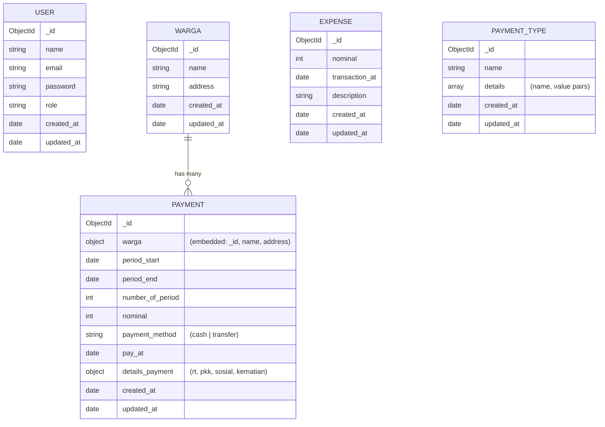
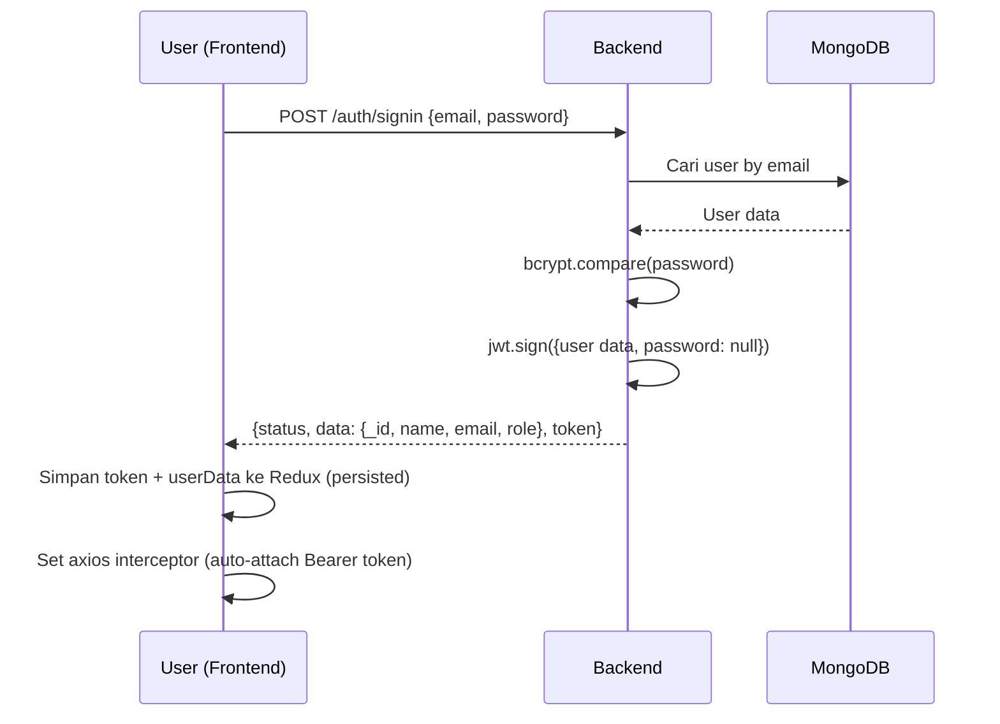
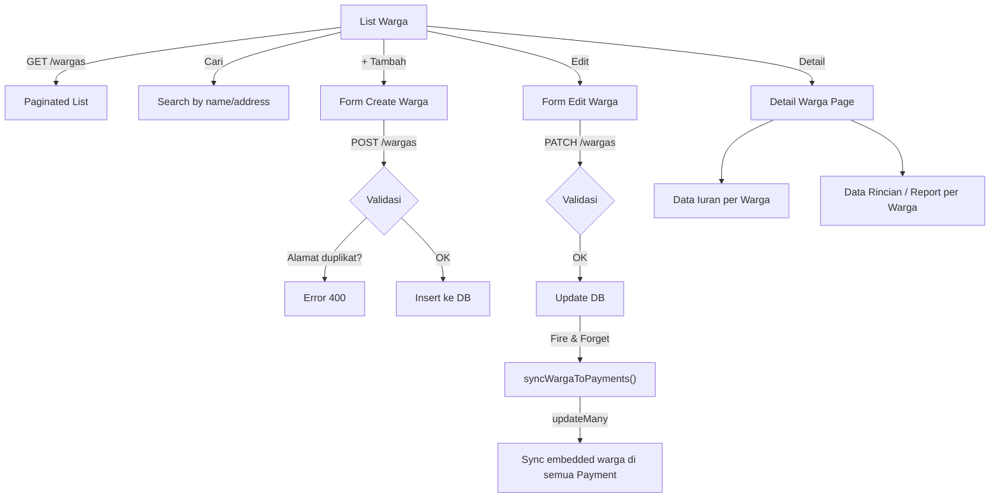
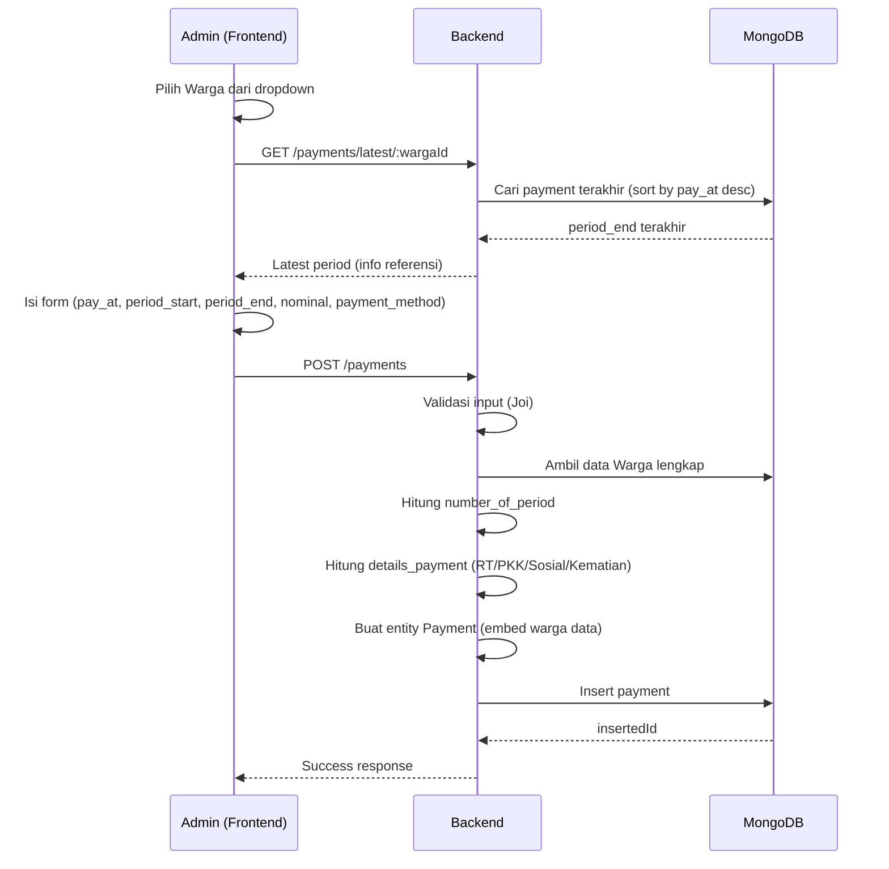
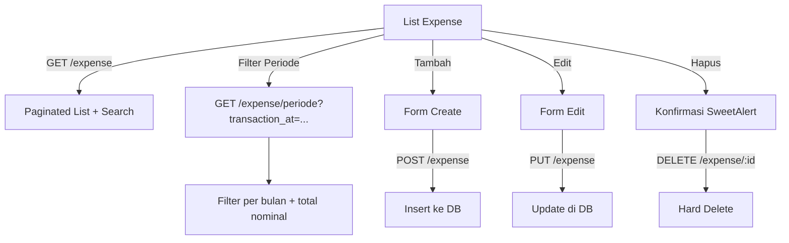
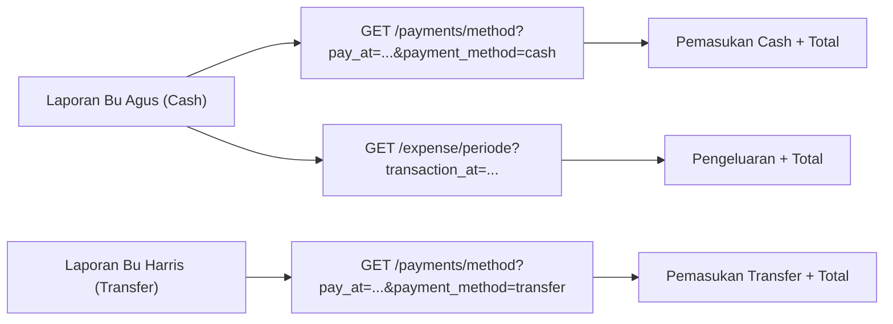
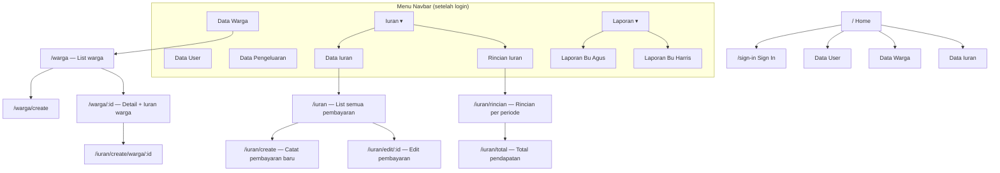
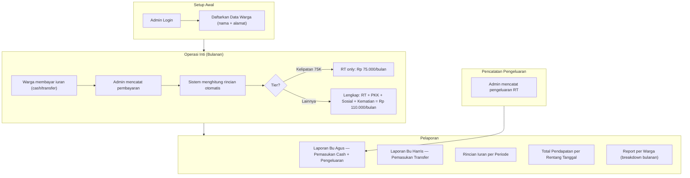

# Technical Review: Bisnis Proses Aplikasi Iuran RT

## 1. Ringkasan Aplikasi

Aplikasi **Iuran RT** adalah sistem pencatatan pembayaran iuran warga RT. Aplikasi terdiri dari dua repository:

| Komponen     | Repository      | Tech Stack                                                       |
| ------------ | --------------- | ---------------------------------------------------------------- |
| **Backend**  | `api-iuran-rt`  | Express.js, MongoDB, JWT, Joi, bcrypt                            |
| **Frontend** | `iuran-rt-apps` | React 18, Bootstrap 5, Redux + redux-persist, Axios, SweetAlert2 |

Deployment backend menggunakan **Vercel** (ada `vercel.json`). Database menggunakan **MongoDB** dengan 3 database terpisah (payment, user, warga) masing-masing memiliki collection tersendiri, di-switch berdasarkan environment (`development` / `local` / `production`).

---

## 2. Arsitektur Backend

### 2.1 Layered Architecture

```
Routes → Middleware (JWT/Admin) → Controllers → Repositories → MongoDB
                                      ↓
                                   DTOs (Joi Validation)
                                   Entities (Data Schema)
                                   Helpers (Business Logic)
                                   Workers (Async Tasks)
```

### 2.2 Data Model (Entities)



> **Embedded Document Pattern**: Data warga di-embed langsung ke dalam dokumen Payment (`warga._id`, `warga.name`, `warga.address`). Ini merupakan denormalized design — jika data warga berubah, perlu disinkronkan ke semua payment terkait (ditangani oleh `wargaSync.worker.js`).

### 2.3 Middleware & Authorization

| Middleware   | File                           | Fungsi                                                           |
| ------------ | ------------------------------ | ---------------------------------------------------------------- |
| `checkToken` | `middleware/jwt.middleware.js` | Verifikasi JWT token dari header `Authorization: Bearer <token>` |
| `adminRole`  | `middleware/middleware.js`     | Verifikasi token + cek `role === "admin"`. Menolak non-admin     |

> **Semua endpoint data** (warga, payments, users, expense) dilindungi `adminRole`. Hanya Sign In (`POST /auth/signin`) yang bersifat public. Sign Up juga dilindungi `adminRole`, artinya hanya admin yang bisa membuat user baru.

---

## 3. Bisnis Proses Detail

### 3.1 Autentikasi (Auth)



**Key Points:**

- Password di-hash dengan **bcrypt** (salt rounds: 10)
- JWT payload berisi seluruh data user (tanpa password)
- Token tidak memiliki **expiry** (tidak ada `expiresIn` pada `jwt.sign`)
- Frontend menyimpan auth state via **redux-persist** ke `localStorage`
- Logout = clear `localStorage` + reset Redux state

### 3.2 Manajemen Warga

**Alur CRUD:**



**Key Points:**

- Warga memiliki `name` dan `address`
- `address` bersifat **unique** — tidak boleh duplikat (dicek saat create dan update)
- Format address: **prefix-number** (contoh: `K3-5`, `K1-12A`, `K2-10`). Prefix menunjukkan blok/gang dan number menunjukkan nomor rumah. Sorting address menggunakan aggregation pipeline yang memecah prefix dan number secara terpisah agar urutan numerik benar
- Saat update warga, data warga yang ter-embed di dokumen Payment akan disinkronkan secara **asinkron** (fire-and-forget pattern) via `workers/wargaSync.worker.js`
- Halaman **Detail Warga** menampilkan: info warga + semua pembayaran iuran warga tersebut + laporan rincian per bulan

### 3.3 Pencatatan Iuran (Payments) — **Core Business Process**

#### 3.3.1 Flow Pencatatan Pembayaran



#### 3.3.2 Logika Perhitungan Iuran (2-Tier Pricing)

Dari `helpers/payment.helper.js`:

```
getNumberOfPeriods():
  number_of_period = (year_end - year_start) × 12 + (month_end - month_start) + 1
```

```
getDetailsPayment():
  JIKA nominal HABIS DIBAGI 75.000 (nominal % 75000 === 0):
    → RT    = 75.000 × jumlah_bulan
    → PKK   = 0
    → Sosial = 0
    → Kematian = 0

  SELAINNYA (nominal TIDAK habis dibagi 75.000):
    → RT    = 94.500 × jumlah_bulan
    → PKK   =  8.000 × jumlah_bulan
    → Sosial =  2.500 × jumlah_bulan
    → Kematian = 5.000 × jumlah_bulan
```

**Interpretasi Bisnis:**
| Tier | Tarif/Bulan | Komposisi | Total/Bulan |
|------|------------|-----------|-------------|
| **Tier 1** (RT saja) | Rp 75.000 | RT saja, tanpa PKK/Sosial/Kematian | Rp 75.000 |
| **Tier 2** (Lengkap) | Rp 110.000 | RT (94.500) + PKK (8.000) + Sosial (2.500) + Kematian (5.000) | Rp 110.000 |

> **Logika deteksi tier** berdasarkan `nominal % 75000 === 0`. Artinya jika warga membayar kelipatan 75K (75K, 150K, 225K dst.), dianggap Tier 1. Selain itu dianggap Tier 2.

> ⚠️ **Realita Lapangan — Kelebihan Bayar (Overpayment)**
>
> Di lapangan, nominal pembayaran sangat **dinamis**. Contoh kasus:
>
> - Warga A memiliki kewajiban Rp 110.000/bulan
> - Warga A bayar periode Januari–Mei = 5 bulan × Rp 110.000 = Rp 550.000
> - Namun warga A membayar **Rp 600.000** → kelebihan Rp 50.000
> - Dalam pencatatan manual, bendahara memasukkan kelebihan ke **periode berikutnya**
> - Misal tagihan 7 bulan berikutnya: Rp 770.000 − Rp 50.000 = **Rp 720.000**
>
> **Skenario ini belum diakomodir oleh aplikasi saat ini.** Rencana ke depan: membuat **master tier pricing** yang ditempelkan per warga, sehingga sistem bisa menghitung kelebihan/kekurangan bayar secara otomatis. Ditunda karena banyak variasi custom case.
> Untuk saat ini, jika ada kelebihan bayar, bendahara harus mencatatnya secara manual rincian iuran (sudah disediakan manual input untuk rincian iuran).

#### 3.3.3 Field Payment

| Field              | Tipe   | Sumber                 | Keterangan                          |
| ------------------ | ------ | ---------------------- | ----------------------------------- |
| `warga`            | Object | Embedded dari DB Warga | `{_id, name, address}`              |
| `period_start`     | Date   | Input admin            | Awal periode bayar                  |
| `period_end`       | Date   | Input admin            | Akhir periode bayar                 |
| `number_of_period` | Number | Auto-calculated        | Jumlah bulan (dihitung dari period) |
| `nominal`          | Number | Input admin            | Total nominal yang dibayar          |
| `payment_method`   | String | Input admin            | `"cash"` atau `"transfer"`          |
| `pay_at`           | Date   | Input admin            | Tanggal pembayaran aktual           |
| `details_payment`  | Object | Auto-calculated        | `{rt, pkk, sosial, kematian}`       |

#### 3.3.4 Report per Warga (Monthly Breakdown)

`GET /payments/report/:wargaId` → `helpers/payment.helper.js` → `getAllMonthsBetween()`

Fungsi ini memecah setiap payment menjadi daftar per bulan:

- Iterasi dari `period_start` hingga `period_end`
- Setiap bulan menghasilkan entry: `{period: "April 2024", nominal: total/jumlah_bulan, pay_at, created_at}`
- Nominal per bulan = total nominal ÷ jumlah bulan

### 3.4 Pengeluaran (Expense)

**Alur CRUD sederhana:**



**Field: `nominal`, `transaction_at`, `description`**

### 3.5 Laporan Keuangan (Reports)

Ada **2 laporan terpisah** berdasarkan metode pembayaran:

| Laporan               | Route Frontend     | Metode Pembayaran | Fitur Tambahan                         |
| --------------------- | ------------------ | ----------------- | -------------------------------------- |
| **Laporan Bu Agus**   | `/report/cash`     | Cash              | ✅ Termasuk data Pengeluaran (Expense) |
| **Laporan Bu Harris** | `/report/transfer` | Transfer          | ❌ Hanya data pemasukan                |



> **Bu Agus** = Bendahara penerima uang **cash** sekaligus penanggung jawab **pengeluaran** RT. Oleh karena itu laporannya menampilkan data pemasukan cash DAN pengeluaran.
> **Bu Harris** = Bendahara penerima **transfer**. Hanya bertugas menerima pemasukan melalui transfer, tidak mengelola pengeluaran.

### 3.6 Manajemen User

| Operasi | Endpoint            | Catatan                                           |
| ------- | ------------------- | ------------------------------------------------- |
| List    | `GET /users`        | Admin only                                        |
| Detail  | `GET /users/:id`    | Admin only                                        |
| Create  | `POST /auth/signup` | Admin only (melalui frontend /user/create)        |
| Update  | `PATCH /users`      | Admin only, password optional, email unique check |
| Delete  | `DELETE /users/:id` | Admin only, Hard Delete                           |

**User fields:** `name`, `email`, `password`, `role`

> **Role** disimpan sebagai string bebas (tidak ada enum di backend). Middleware hanya mengecek `role === "admin"`. Role selain "admin" tidak memiliki akses ke data manapun.

---

## 4. Alur Navigasi Frontend



---

## 5. API Endpoints Reference

### Auth

| Method | Endpoint       | Auth      | Deskripsi          |
| ------ | -------------- | --------- | ------------------ |
| POST   | `/auth/signin` | ❌ Public | Login              |
| POST   | `/auth/signup` | ✅ Admin  | Register user baru |

### Warga

| Method | Endpoint         | Deskripsi                     |
| ------ | ---------------- | ----------------------------- |
| GET    | `/wargas`        | List paginated + search       |
| GET    | `/wargas/option` | List semua (untuk dropdown)   |
| GET    | `/wargas/:id`    | Detail by ID                  |
| POST   | `/wargas`        | Create (address unique check) |
| PATCH  | `/wargas`        | Update + sync ke payments     |
| DELETE | `/wargas/:id`    | Hard delete                   |

### Payments

| Method | Endpoint               | Deskripsi                                                  |
| ------ | ---------------------- | ---------------------------------------------------------- |
| GET    | `/payments`            | List paginated + search                                    |
| GET    | `/payments/:id`        | Detail by ID                                               |
| GET    | `/payments/warga/:id`  | Semua payment milik warga                                  |
| GET    | `/payments/latest/:id` | Period terakhir warga                                      |
| GET    | `/payments/report/:id` | Report bulanan per warga                                   |
| GET    | `/payments/rincian`    | Filter by pay_at month                                     |
| GET    | `/payments/total`      | Total income by date range                                 |
| GET    | `/payments/method`     | Filter by method + month                                   |
| POST   | `/payments`            | Create payment (accepts optional details_payment override) |
| PUT    | `/payments`            | Update payment (accepts optional details_payment override) |
| DELETE | `/payments/:id`        | Hard delete                                                |

### Expense

| Method | Endpoint           | Deskripsi               |
| ------ | ------------------ | ----------------------- |
| GET    | `/expense`         | List paginated + search |
| GET    | `/expense/:id`     | Detail by ID            |
| GET    | `/expense/periode` | Filter by month         |
| POST   | `/expense`         | Create                  |
| PUT    | `/expense`         | Update                  |
| DELETE | `/expense/:id`     | Hard delete             |

### Users

| Method | Endpoint     | Deskripsi    |
| ------ | ------------ | ------------ |
| GET    | `/users`     | List semua   |
| GET    | `/users/:id` | Detail by ID |
| PATCH  | `/users`     | Update       |
| DELETE | `/users/:id` | Hard delete  |

> Semua endpoint kecuali `/auth/signin` memerlukan token admin (`adminRole` middleware).

---

## 6. Temuan & Catatan Teknis

### 6.1 Potensi Issue

| #   | Area             | Temuan                                                                                                                                                                             | Severity  |
| --- | ---------------- | ---------------------------------------------------------------------------------------------------------------------------------------------------------------------------------- | --------- |
| 1   | **Auth**         | JWT tidak memiliki expiry time (`expiresIn`). Token valid selamanya selama private key tidak berubah.                                                                              | ⚠️ Medium |
| 2   | **Auth**         | Sign Up tidak mengembalikan early return setelah "Email already exists", sehingga code lanjut ke hashing password meskipun email duplikat.                                         | 🔴 Bug    |
| 3   | **Warga**        | Create warga juga tidak mengembalikan early return setelah address duplicate / name empty / address empty check. Controller bisa mengirim response ganda.                          | 🔴 Bug    |
| 4   | **Payment**      | Deteksi tier pricing (`nominal % 75000 === 0`) bisa keliru jika nominal kebetulan kelipatan 75K tapi sebenarnya warga membayar tier 2. Rencana: **master tier pricing per warga**. | ⚠️ Medium |
| 5   | **Payment**      | Validasi overlap periode di-comment out (disabled). Warga bisa memiliki pembayaran dengan periode yang tumpang tindih.                                                             | ⚠️ Medium |
| 6   | **Payment**      | Belum ada mekanisme **overpayment carry-over** — kelebihan bayar tidak otomatis dikurangi dari tagihan berikutnya.                                                                 | ⚠️ Medium |
| 7   | **Delete**       | Semua data menggunakan Hard Delete. Tidak ada soft delete mechanism. Data yang terhapus tidak bisa dikembalikan.                                                                   | ℹ️ Info   |
| 8   | **PaymentType**  | Repository `paymentType.repository.js` memiliki bug di `getAll()` — variabel `query` dan `options` tidak didefinisikan sebelum digunakan.                                          | 🔴 Bug    |
| 9   | **PaymentType**  | Entity dan repository PaymentType sudah ada, tapi tidak digunakan sama sekali oleh controller manapun dan tidak ada route-nya.                                                     | ℹ️ Info   |
| 10  | **Security**     | JWT payload menyertakan seluruh data user (termasuk `_class`, `created_at`, dll) — hanya password yang di-null-kan.                                                                | ℹ️ Info   |
| 11  | **Auth Reducer** | Redux `auth` slice masih memiliki field `recipes` yang tampaknya sisa dari project lain dan tidak digunakan.                                                                       | ℹ️ Info   |

> Bug #2 dan #3 (missing early return) sudah memiliki **rencana perbaikan** yang disiapkan sebelumnya. Perbaikan akan dieksekusi terpisah.

### 6.2 Pattern yang Bagus

| #   | Area                 | Catatan                                                                                                                                                                                                                                                                        |
| --- | -------------------- | ------------------------------------------------------------------------------------------------------------------------------------------------------------------------------------------------------------------------------------------------------------------------------ |
| 1   | **Warga Sync**       | Fire-and-forget pattern untuk sinkronisasi data warga ke payment records — tidak blocking response user                                                                                                                                                                        |
| 2   | **Address Sorting**  | MongoDB aggregation pipeline yang memecah address menjadi prefix, number, dan suffix untuk natural sorting                                                                                                                                                                     |
| 3   | **DTO Validation**   | Penggunaan Joi schema untuk validasi input yang konsisten di semua endpoint                                                                                                                                                                                                    |
| 4   | **Custom Hooks**     | Frontend menggunakan custom hooks (`usePayments`, `useCreatePayments`, `useEditPayments`, `useUsers`, `useTableState`) untuk separation of concern. `useTableState` secara inovatif mem-_persist_ parameter query pencarian (_Page, limit, sort_) langsung ke Session Storage. |
| 5   | **Security Headers** | Penggunaan Helmet.js dan XSS-Clean middleware                                                                                                                                                                                                                                  |
| 6   | **Latest Period**    | UX yang baik — saat create pembayaran, auto-fetch periode terakhir warga sebagai referensi                                                                                                                                                                                     |

---

## 7. Ringkasan Alur Bisnis


